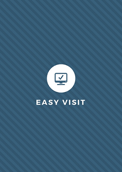
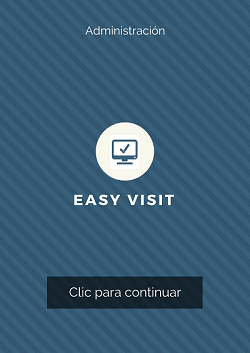
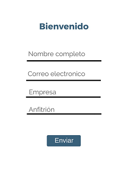
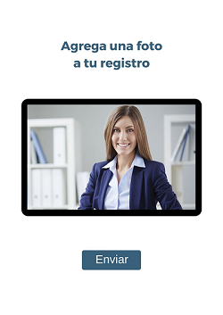
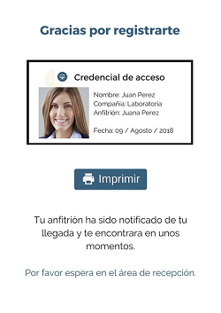
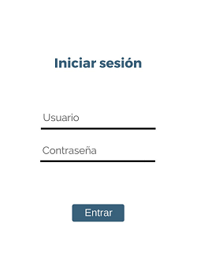

# Registro de Visitantes

# El problema :boom:

En el mundo tecnológico en el que vivimos hoy día las estaciones de trabajo son conformadas por una comunidad de emprendedores y creativos, adoptando el nombre de **coworking** tienen como principales objetivos reflejar una imagen de sinergia y productividad.

Sin embargo en muchos de estos lugares el proceso de registro de visitantes es tedioso lo cual da una imagen anticuada a la empresas y causa problemas como perdidas de documentos de identidad y en varias ocasiones una larga espera en recepción que retrasa los horarios de citas asignados anteriormente.

# Investigación y estrategia :pencil:

Como empresa tecnológica proponemos desarrollar un app web que reúna la información de invitados, capture sus fotos y notifique a los anfitriones de la llegada de un visitante, todo desde un iPad.

## Objetivos del negocio

 - Reinventar el proceso de registro de visitantes para mejorar sus servicios, sorprender a los visitantes con una primera impresión moderna de la marca y por ende competir con un coworking de mayor magnitud.

 - Optimizar el inicio de sesión de los visitantes, aumentando la eficiencia de recepción, sin importar el numero de visitantes con los que se cuente por día identificando fácilmente quién está autorizado para estar en el sitio.

## Usuario

 Estudiamos a los usuarios que van a utilizar nuestro producto y definimos nuestra audiencia potencial mediante usuarios ficticios.

### Historias de usuario

- Historia de usuario **No. 1**: **Como** visitante de un coworking **quiero** registrarme de forma rápida y sencilla **para** acceder a mi cita en tiempo y forma.

- Historia de usuario **No. 2**: **Como** administrador de un coworking **quiero** visualizar la información de los usuarios registrados **para** llevar un control de las personas que se encuentran dentro del edificio, de manera rápida y eficaz.

- Historia de usuario **No.3**: **Como** anfitrión en un coworking, **quiero** poder registrar rápidamente a las personas que me visitan y ser notificado en cuanto lleguen **para** no perder tiempo y poder aprovecharlo en los temas a negociar.

### Escenarios y casos de uso

 Definimos los procesos que realizan los usuarios en sus contextos reales, a continuación mostramos un ejemplo:

### Visitas de campo

#### Cliente incógnito
Realizamos visitas para analizar a los usuarios utilizando un producto en un contexto real, el *coworking* que tomaremos como principal comparación es [Forum Naucalpan](http://forumnaucalpan.com.mx/), el lugar en cuestión tiene un proceso de registro muy riguroso y peculiar a la vez, al llegar al edificio nos encontramos con el área de recepción, en la cual nos dan la bienvenida y nos solicitan una identificación oficial (identificaciones de trabajo o cualquier otra índole quedan descartadas) posteriormente proceden indicarnos que nos tomaran una foto para el registro y toman los datos de a que piso accederemos y con quien (en este punto cabe destacar que la señorita de recepción nos indica que anteriormente entregaban un sticker que identificaba a los visitantes, pero desde hace un par de semanas esta opción ya no está en funcionamiento) una vez registrados accedemos al área de torniquetes que dan acceso a los elevadores en esta parte el oficial de seguridad es quien nos permite la entrada y nos indica el piso que visitaremos, en el piso de la persona a la que se visita existe una especie de altavoz que nos permite vocear a quien visitamos, debemos esperar a que el anfitrión salga a recibirnos para finalmente poder acceder y comenzar nuestra reunión.

##### Colusiones de la visita
Al finalizar la reunión nos queda una sensación de un proceso larguísimo y complicado, muchas veces no teníamos la certidumbre de para que nos estaban tomando una foto si ya contaban con nuestra identificación o si perderíamos demasiado tiempo en recepción y llegaríamos en tiempo a nuestra cita, además de que el proceso de vocear a nuestro anfitrión si bien innovador nos dio muchísima inseguridad en cuestión del tono de nuestra voz, el si nos habían escuchado por el tiempo de espera o si debíamos o no repetir nuestro anuncio.

(*El oficial no nos permitió sacar fotos del interior del edificio*)

#### Entrevistas
 Para poder identificar y empatizar con nuestro usuario final se realizaron entrevistas con personas de diferentes roles en el proceso de registro:

1. El ingeniero *Ricardo Diaz* anfitrión en el *coworking* Forum Naucalpan, nos comparte que para poder recivir un visitante no hace falta que lo de de alta ni tiene que seguir ningun protocolo en especial, sin embargo cuando llega a tener alguno tiene que pasar por el procedimieto de recepcion y el no se entera que su invitado llego  hastasube a su piso y lo vocea y que en varias ocaciones no ah escuchado el altavoz haciendo esperar a su invitado, por lo cual una notificacion desde que el usuario a llegado al edificio, facilitaria de forma importante este proceso para el.
[Audio de entrevista](audio.com)

2. La señorita *Miriam*, encargada en recepción del *coworking* **Terminal 1**, nos comenta que el proceso de registro de un visitante consta de 2 partes primero con vigilancia que los canaliza y anota sus datos en una libreta, para posteriormente pasar con ella y volver a registrar sus datos en otra libreta, se llama por teléfono a la persona que visitan y si se autoriza el acceso la persona entra o espera en recepción. Algunos de los inconvenientes encontrados son que al ser 36 oficinas es complicado memorizar o buscar el número de extensión para notificar a una persona que tiene un visitante o que no respondan el teléfono y el visitante tenga que esperar largo tiempo en recepción.
 [Audio de entrevista](audio.com)

3. El señor *Serafín Nava* encargado de seguridad en la *casa de cultura:* "*Jesús Romero Flores*" nos indica que en el proceso de seguridad que él lleva a cabo es primero visual ya que requiere identificar que las personas no se vean sospechosas para permitirles el registro, un dato importante es que el cuenta con un boton de panico que le da seguridad en caso de que llegara a ingresar una persona no autorizada al edificio, en su caso tanbien nos comenta que muchas veces se le complica el poder leer los nombres por la letra con la que se registran los visitantes.
[Audio de entrevista](audio.com)

 ### Benchmark

Realizamos un estudio de mercado y/o de productos similares para realizar o re-diseñar.

# Diseño de Interacción :books:

A partir de todos los datos obtenidos en la fase anterior, vamos a proceder a su organización y categorización.

## Navegación y usabilidad

Definimos todos los flujos funcionales que tendrá nuestra app web tanto del lado del usuario para el registro, como para el administrador con la consulta de los datos:

#### Flujo de usuario para registro:

#### Flujo de administración para consulta de visitantes:

# Diseño Visual :art:

En un proceso de diseño colaborativo (en equipo) decidimos nombrar a nuestra marca **Easy Visit** y asignar una gama de colores en azules y grises para denotar armonía y seriedad.

## Logotipo

El logotipo de *Easy Visit* se compone de de una computadora con un símbolo de check para dar una sensación de coherencia y fijar en la memoria el propósito de la marca.

## Colores

El color azul es el que más predomina en el diseño debido a que según la psicología del color, el azul simboliza armonía, fidelidad, simpatía, paz, serenidad, confianza, comunicación, etc. y precisamente en un proceso de registro que puede llegar a estresar al usuario el propósito es brindarle la mayor comodidad y agrado posibles en el proceso.

## Prototipos de alta fidelidad

### Vistas de registro

## Vistas de administración

## [Prototipo clickable](https://marvelapp.com/9b9ijf7)

# Validación :heavy_check_mark:

En esta etapa nuestro objetivo es comprobar la calidad del diseño propuesto.

## Test con usuarios

Es una prueba de usabilidad nos apoyamos como primer herramienta de la observación y análisis de cómo un grupo de usuarios reales utilizan nuestra app web, anotando los problemas de uso con los que se encuentran para poder solucionarlos posteriormente, a continuación los resultados obtenidos:

## [Video de interacción](https://vimeo.com/user88424915/review/284940626/ba70774d64)